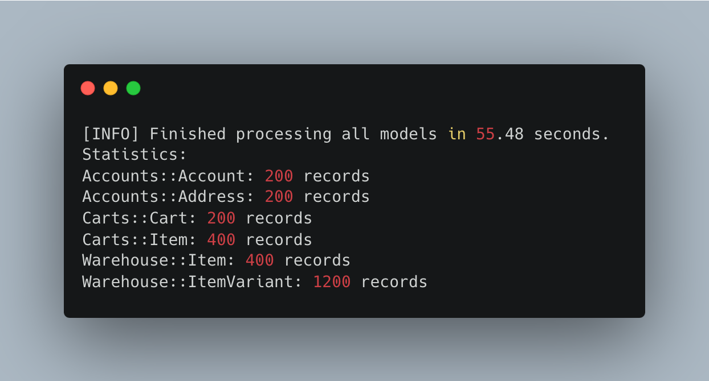
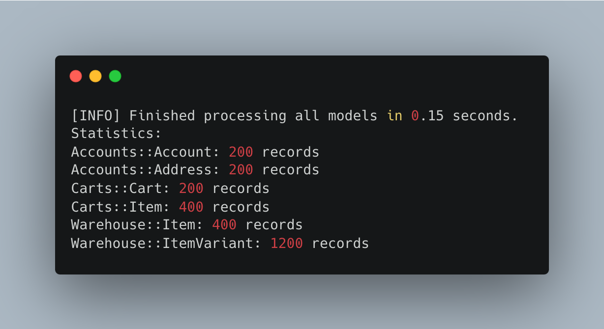

# BetterSeeder

BetterSeeder is a Rails gem designed to simplify and centralize your application's seeding process. It offers a flexible system to generate dynamic data, validate it using Dry-schema, enforce uniqueness constraints, load data into the database, and export it in various formats (SQL, CSV, JSON). The configuration is managed through a Rails initializer, while model-specific logic is defined in dedicated structure files.

## Statistics

Below are two images displaying key statistics from the seeding process:

- **Initial Generation Statistics:**  
  This chart represents metrics from the very first generation run.



- **Reload Data Statistics:**  
  This chart shows the metrics after reloading data (from the SQL file) into the database.



---

## Features

- **Dynamic Data Generation**  
  Define custom data generators for each model in dedicated structure files.

- **Validation and Uniqueness**  
  Validate generated records using Dry-schema and enforce uniqueness constraints across one or multiple columns.

- **Loading & Exporting**  
  Load generated data directly into your database—supporting parent/child relationships—and export the data as a single SQL INSERT statement, CSV, or JSON file.

- **Centralized Configuration**  
  Customize settings such as `log_language`, `structure_path`, and `preload_path` via a Rails initializer. If no initializer is provided, default settings apply.

- **Initializer Installation**  
  An install method creates the necessary initializer file in your Rails application to streamline setup.

- **Rails Generator**  
  A custom Rails generator scaffolds a structure file template for your models, ensuring a consistent configuration format.

- **Child Record Generation**  
  Now, BetterSeeder supports generating multiple child records per parent record. In your model’s seed configuration, you can define a `childs` section that specifies the number of child records to generate for each parent, along with attribute arrays to assign distinct values for each child. This allows for a total record count equal to *(parent count) × (childs count)*.

---

## Installation

Add the gem to your Gemfile:

```ruby
gem 'better_seeder'
```

Then run:

```bash
bundle install
```

---

## Configuration

BetterSeeder uses a centralized configuration defined in `BetterSeeder.configuration`. You can override the default settings by creating an initializer. For example, create a file:

```ruby
# config/initializers/better_seeder.rb
require 'better_seeder'

BetterSeeder.configure do |config|
  config.log_language   = :en
  config.structure_path = Rails.root.join('db', 'seed', 'structure')
  config.preload_path   = Rails.root.join('db', 'seed', 'preload')
end
```

If these values are set in the initializer, they will be used; otherwise, the gem will use its default values.

---

## Initializer Installation

To streamline the setup, execute the following command in your Rails console:

```bash
BetterSeeder.install
```

This command creates (if not already present) the file `config/initializers/better_seeder.rb` with the necessary configuration.

---

## Structure Files

For each model, create a structure file that centralizes the logic for generating, validating, and configuring seed data. Each structure file should include:

- **`structure`**  
  Returns a hash where each key is an attribute and its value is an array in the format `[type, lambda_generator]`.

- **`seed_schema` (Optional)**  
  Defines a Dry-schema for validating generated records.

- **`seed_config`**  
  Returns a hash with model-specific seeding settings:
    - `file_name`: The output file name (without extension)
    - `columns: { excluded: [...] }`: Columns to exclude from the generated data
    - `generate_data`: Boolean flag indicating whether to generate data dynamically (if false, existing records are used)
    - `count`: The number of parent records to generate (default: 10)
    - `load_data`: Boolean flag indicating whether the generated records should be inserted into the database
    - `parent`: For child models, specifies the parent model(s) used for injecting foreign keys
    - **`childs` (Optional):** A hash to define child record generation:
        - `count`: The number of child records to generate for each parent.
        - `attributes`: A hash mapping attribute names to an array of values. Each child record will receive a distinct value from the provided array.

- **`unique_keys` (Optional)**  
  Returns an array of column groups (each group is an array of symbols) that must be unique. For example:

  ```ruby
  def self.unique_keys
    [[:email], [:first_name, :last_name]]
  end
  ```

### Example Structure File

```ruby
# db/seed/structure/my_namespace/my_model_structure.rb
module MyNamespace
  class MyModelStructure < BetterSeeder::StructureBase
    def self.structure
      {
        name:       [:string,   -> { FFaker::Name.name }],
        email:      [:string,   -> { FFaker::Internet.email }],
        created_at: [:datetime, -> { Time.zone.now }]
      }
    end

    def self.seed_schema
      Dry::Schema.Params do
        required(:name).filled(:string)
        required(:email).filled(:string)
        required(:created_at).filled(:time)
      end
    end

    def self.seed_config
      {
        file_name: 'my_model_seed',
        columns: { excluded: [:id, :updated_at] },
        generate_data: true,
        count: 50,
        load_data: true,
        parents: [
          { model: ::MyNamespace::MyModelParent, column: :column_id }
        ],
        childs: {
          count: 3,
          attributes: {
            some_attribute: ['value1', 'value2', 'value3']
          }
        }
      }
    end

    def self.unique_keys
      [[:email]]
    end
  end
end
```

---

## How It Works

When you call `BetterSeeder.magic` with a configuration that contains an array of model names (as strings), the gem will:

1. **Load Structure Files**  
   Retrieve the corresponding structure file from the directory defined by `BetterSeeder.configuration.structure_path` for each model.

2. **Retrieve Seeding Configurations**  
   Invoke the model's `seed_config` method to obtain its specific settings.

3. **Generate or Retrieve Records**  
   Use the `structure` method to generate data dynamically (or fetch existing records) and validate them using `seed_schema` if defined. Uniqueness is enforced via `unique_keys`.

4. **Handle Parent/Child Relationships**  
   Automatically inject foreign keys into child models using records from parent models. With the new functionality, if a `childs` configuration is present, the gem generates child records for each parent record. For example, if `count` is set to 200 and `childs[:count]` is set to 2, a total of 400 records will be generated. Each child record receives distinct attribute values from the specified arrays.

5. **Load and Export Data**  
   If enabled (`load_data: true`), the generated records are inserted into the database and exported in the specified format (SQL, CSV, or JSON). Export files are saved in the directory specified by `BetterSeeder.configuration.preload_path`.

### Example Usage

```ruby
BetterSeeder.magic(
  {
    configurations: { export_type: :sql },
    data: [
      'MyNamespace::MyModel',
      'OtherNamespace::OtherModel'
    ]
  }
)
```

---

## Rails Generator

A custom Rails generator is available to scaffold a structure file template for your models. Execute the following command:

```bash
rails generate better_seeder:structure MyNamespace::MyModel
```

This command creates a structure file template in the appropriate subdirectory under `db/seed/structure`. The generated template includes placeholders for:

- Attribute generators (via the `structure` method)
- Validation schema (via the `seed_schema` method)
- Seeding configuration (via the `seed_config` method)
- Uniqueness constraints (via the `unique_keys` method)

### Example Generated Template

```ruby
module MyNamespace
  class MyModelStructure < BetterSeeder::StructureBase
    def self.structure
      {
        attribute_name: [:string, -> { "your value" }]
      }
    end

    def self.seed_schema
      Dry::Schema.Params do
        required(:attribute_name).filled(:string)
      end
    end

    def self.seed_config
      {
        file_name: 'my_model_seed',
        columns: { excluded: [] },
        generate_data: true,
        count: 10,
        load_data: true,
        parent: nil
      }
    end

    def self.unique_keys
      []
    end
  end
end
```

This generator ensures a consistent structure for your seeding configuration across models.

---

## Contact & Feature Requests

For suggestions, bug reports, or to report new feature requests, please reach out via email at: **alessio.bussolari@pandev.it**.

---

## Upcoming Features

The development team is continuously enhancing BetterSeeder. Current efforts include:

- **Additional Export Formats:** Expanding beyond SQL, CSV, and JSON to offer more options.
- **Enhanced Rails Associations Integration:** Improving support for complex parent/child relationships.
- **Expanded Configuration Options:** Providing more granular control over the seeding process.
- **Performance Optimizations:** Refining data generation algorithms for faster processing.

---

## Conclusion

BetterSeeder provides a modular, configurable, and extensible system for seeding your Rails application's data. Its key benefits include:

- **Centralized Configuration:** Manage settings through a simple Rails initializer.
- **Modular Structure Files:** Define data generation, validation, and configuration logic on a per-model basis.
- **Seamless Data Handling:** Efficiently generate, validate, load, and export seed data while supporting complex relationships—now with enhanced child record generation for a more realistic data model.

For further details or to contribute, please refer to the official repository or documentation.